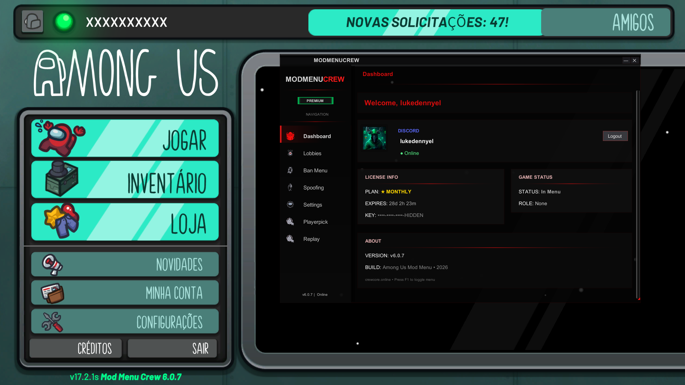
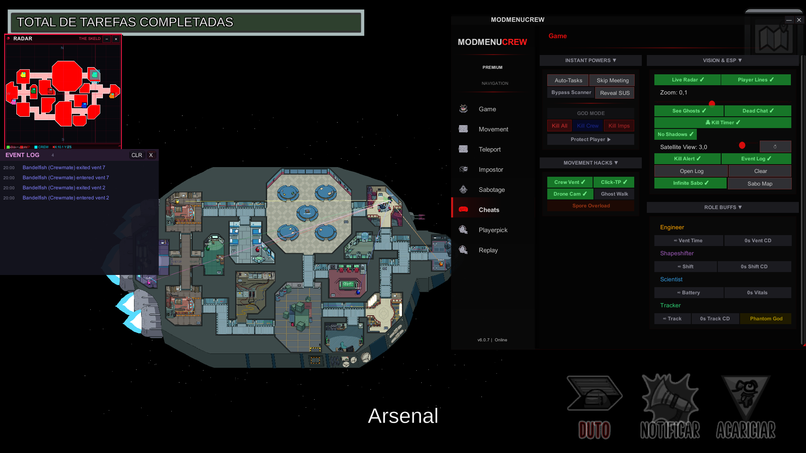
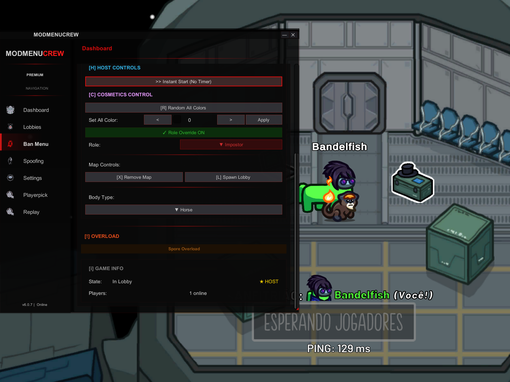
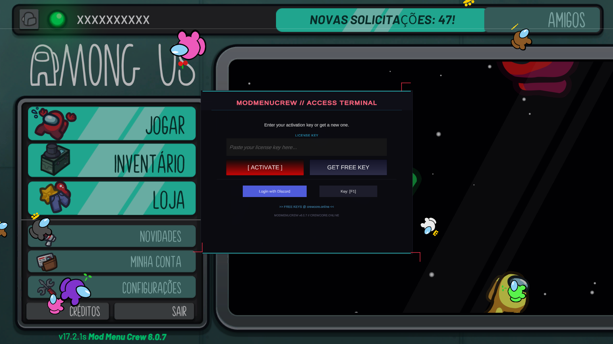
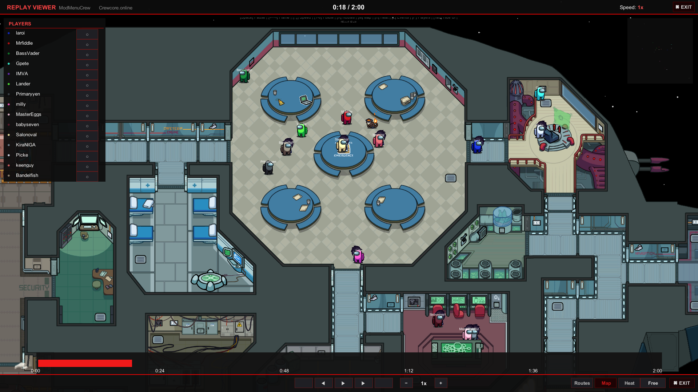

  

<!-- H1 Optimized for Primary Keywords -->
<h1 align="center">🚀 ModMenuCrew v6.0.8 — Among Us Mod Menu 2026</h1>

  <b>The most professional and stable Among Us Mod Menu on the market — free or paid. Built for reliability. Designed for everyone.</b>

<!-- Dynamic Badges (live counters) -->

  
  
  
  
  

<!-- Tech Badges -->

  
  
  
  
  
  

  
  &nbsp;
  

---

## 📑 Table of Contents

- [🚀 What's New (v6.0.8)](#-v608--anti-overload--stability-update)
- [📖 About](#-about-modmenucrew)
- [🖼️ Screenshots](#%EF%B8%8F-screenshots)
- [⚡ All Features](#-all-features-v608)
- [🖥️ Compatibility](#%EF%B8%8F-compatibility)
- [📥 Installation](#-installation)
- [🔑 Key System](#-key-system--activation)
- [⭐ Premium Plans](#-premium-plans)
- [❓ FAQ](#-faq)
- [⭐ Star History](#-star-history)

---

## 🚀 V6.0.8 — Anti-Overload & Stability Update

Version 6.0.8 brings major stability and security enhancements, the highly anticipated **Anti-OVERLOAD protection**, crucial SSL fixes for Linux/macOS, and core engine upgrades.

### ✨ What's New

| Feature | Description |
|:--------|:------------|
| 🛡️ **Anti-OVERLOAD** | MMC users are now **immune** to connection drops caused by Premium users spamming the OVERLOAD feature. Everyone else disconnects — MMC users stay in the game. |
| 👁️ **Reveal Votes** | New toggle in the Settings tab to see who voted for whom during meetings. |

### 🔧 Bug Fixes

- **Fixed Discord Login button** failing to open on some outdated Windows versions.
- **Fixed critical SSL errors** across all Linux and macOS builds (Wine/Proton).
- **Fixed Satellite View** not resetting properly after a match ends.
- **Fixed lobby chat bug** where setting Satellite View above `3.1f` prevented the user from typing.

### ⚙️ Security, Performance & Engine

- **Updated BepInEx** to build `754` for improved game compatibility and performance.
- Deployed general stability and security improvements for all MMC users.
- Rolled out backend refinements to the website and free API for better stability and overall user experience.

---

## 📖 About ModMenuCrew

**ModMenuCrew** is the most professional, stable, and feature-rich **Among Us Mod Menu for PC** in 2026. Engineered for reliability and built for everyone — from casual players to streamers and content creators who demand full lobby control.

Unlike other mods that crash, break on updates, or disappear overnight, **ModMenuCrew is actively maintained** with a dedicated team, a professional website, and a growing community. Whether you use the free tier or go Premium, you get the same level of quality and support.

Built with **BepInEx IL2CPP 6 (build 754)**, making it:
- ✅ **Rock-Solid:** Tested on every Among Us update — we don't break.
- ✅ **Fast:** Performance-optimized for all PCs, including low-end hardware.
- ✅ **Safe:** Enterprise-grade HWID binding, certificate pinning, and zero detected bans.
- ✅ **Cross-Store:** Works on **Steam**, **Epic Games**, **Itch.io**, **Microsoft Store**, and **Xbox App (PC)**.

> **🔥 100% Undetected | Among Us v17.1.0 | Free & Premium Options**

---

## ⚠️ Important Notice

> **⚠️ ATTENTION:** This repository is a **showcase and documentation hub**. Binaries are NOT hosted on GitHub. For safety and auto-updates, download exclusively from our official website.

  

**Why our website instead of GitHub releases?**
1. **Instant Support:** Direct help from the CrewCore team.
2. **One-Click Install:** Simple zip — extract and play.
3. **Active Community:** Join hundreds of active users on Discord.

---

## 🖼️ Screenshots

  
   
  <b>📊 Dashboard — License Info, Game Status & Navigation</b>

  
   
  <b>🎮 Cheats Tab — Instant Powers, Vision & ESP, Movement Hacks, Role Buffs</b>

  
   
  <b>🛠️ Host Controls — Role Override, Cosmetics, Map Control & Overload</b>

  
   
  <b>🔑 Access Terminal — Activate, Get Free Key, or Login with Discord</b>

  
   
  <b>🎬 Replay System — Record, Playback & Analyze Every Match (Exclusive)</b>

---

## 🔗 Fully Independent — No Third-Party APIs

ModMenuCrew is **completely standalone**. Unlike other mods, we do **not** depend on third-party APIs such as Reactor. Our mod runs entirely on its own infrastructure — no external dependencies that can break, go unsupported, or ban mod creators without reason.

> **We control everything** — our server, our website, our CDN, our updates. You're never left waiting on someone else to fix things.

---

## ⚡ All Features (V6.0.8)

### 🎭 Role Control & Manipulation
| Feature | Description |
|:--------|:------------|
| **Role Assigner** | Force **Impostor**, **Crewmate**, **Shapeshifter**, **Engineer**, **Scientist**, **Phantom**, **Viper**. |
| **Always Impostor** | Guarantee the impostor role every game (Host Override). |
| **Live Switch** | Change teams mid-game. |
| **Team Victory** | Force "My Team Win" automatically. |

### 🔓 Unlock All & Spoofing
| Feature | Description |
|:--------|:------------|
| **Unlock All** | Get all **Skins**, **Pets**, **Hats**, **Visors**, and **Nameplates** for free. |
| **Level Spoof** | Set your level to **100**, **999** or any value. |
| **Platform Spoof** | Fake being on **Mobile**, **Xbox**, **PlayStation**, **Switch**, etc. |
| **Anti-Ban** | Patches "IsVersionModded" to prevent kicks. |

### 🛑 Game End Manager (Host Only)
| Feature | Description |
|:--------|:------------|
| **Force Win** | Instantly win as Impostor or Crewmate (Kill, Vote, Sabotage, Task). |
| **Hide & Seek** | Special win conditions for Hide & Seek mode. |
| **Smart Win** | "Force My Team Win" button creates the perfect win scenario. |
| **Anti-End Game** | Prevent the match from ending naturally. |

### 🏃 Movement Speed & Teleport
| Feature | Description |
|:--------|:------------|
| **Speed Hack** | Run up to 10x faster (Speed Multiplier). |
| **Teleport Menu** | Click to teleport to any player. |
| **Click-TP** | Teleport to mouse cursor. |
| **Noclip** | Smooth ghost walk through walls and vents. |
| **FreeCam** | Drone camera mode to explore the map. |

### 👁️ Vision & ESP
| Feature | Description |
|:--------|:------------|
| **Player ESP** | See tracers (lines) to all players. |
| **Radar Map** | Live mini-map overlay with player positions (Skeld map background). |
| **Wallhack** | Full Brightness / No Shadows / No Fog. |
| **Ghost Watcher** | See dead players and read dead chat while alive. |
| **Kill Cooldowns** | View Kill Cooldown timers above other impostors. |
| **Satellite View** | Zoom out greatly for a full-map overview. |
| **Reveal Votes** | See who voted for whom before results are shown. |

### 💀 Impostor & Killer Features
| Feature | Description |
|:--------|:------------|
| **No Kill Cooldown** | Kill instantly with zero wait time (Host). |
| **Kill Distance** | Kill from anywhere on the map. |
| **Mass Kill** | Eliminate 'All Crew', 'All Imps', or 'Everyone'. |
| **God Mode** | Host invincibility — auto-reapplies after kills. |
| **Protect Player** | Shield specific friends from being killed. |
| **Phantom Mode** | 💎 Kill while invisible & vanish completely. |
| **Viper Mode** | 💎 Quick kill ability with body modification. |

### 🔧 Troll & Sabotage
| Feature | Description |
|:--------|:------------|
| **Sabotage Spam** | Fix or break all systems instantly. |
| **Door Control** | Close all doors permanently / Open them individually. |
| **Task Completer** | Instant task finish. |
| **Reveal SUS** | Expose impostors by showing roles on names. |
| **Skip Meeting** | Force meeting to end immediately. |
| **Same Color** | 💎 Force everyone to have the same color. |
| **Random Color All** | 💎 Randomize all player colors at once. |
| **Overload** | 💎 Crash any player or the entire lobby. |

### 🎬 Replay System (Exclusive)
| Feature | Description |
|:--------|:------------|
| **Record & Playback** | Record every game automatically, replay with full controls. |
| **Speed Control** | Increase or decrease playback speed. |
| **Zoom & Routes** | Zoom in/out, toggle player routes, heatmaps. |
| **Player List** | Color-coded player list with role indicators. |

---

## 🖥️ Compatibility

| Store | Architecture | Download |
|:------|:-------------|:---------|
| **Steam** | BepInEx x86 (32-bit) | `Steam V6.0.8.zip` |
| **Itch.io** | BepInEx x86 (32-bit) | Use the **Steam** version |
| **Epic Games** | BepInEx x64 (64-bit) | `EpicGames V6.0.8.zip` |
| **Microsoft Store** | BepInEx x64 (64-bit) | Use the **Epic Games** version |
| **Xbox App (PC)** | BepInEx x64 (64-bit) | Use the **Epic Games** version |

> **OS:** Windows 10 / 11 • **Game:** Among Us v17.1.0+

---

## 📥 Installation

> [!WARNING]
> **IMPORTANT:** Download the mod **EXCLUSIVELY** from [crewcore.online](https://crewcore.online). Files from other sources may be outdated, unsafe, or broken.

### 📋 Requirements

| Dependency | Download Link |
|:-----------|:--------------|
| **BepInEx 6 IL2CPP (be.754)** | [Download Here](https://builds.bepinex.dev/projects/bepinex_be) |
| **.NET 6 Runtime** | [Download Here](https://dotnet.microsoft.com/en-us/download/dotnet/6.0) |

### 🚀 Quick Install
1. **Download** from [crewcore.online](https://crewcore.online) — select your platform (Steam or Epic).
2. **Extract** the zip contents into your `Among Us` game folder.
3. **Launch** the game and press **F1** to open the menu.

> ⚠️ Some features are **Host-Only**. Premium features are marked with 💎.

---

## 🔑 Key System & Activation

ModMenuCrew uses a **key-based activation system** for access control and premium features.

### 🔄 How to Get a Key

1. **Visit** [crewcore.online](https://crewcore.online)
2. **Login** with your Discord account
3. **Join** our Discord server (required)
4. **Generate** your activation key
5. **Copy** the key and paste in-game (press F1)

### 📋 Key Types

| Type | Duration | Features |
|:-----|:---------|:---------|
| **Free** | Single Session | **99% of all features** — everything except 💎 exclusives |
| **Premium** | 48h to Lifetime | **100% of all features** — including all 💎 exclusives |

---

## ⭐ Premium Plans

### 🆓 Free vs 💎 Premium

| Aspect | 🆓 Free | 💎 Premium |
|:-------|:--------|:-----------|
| **Activation** | Shortener links (2 steps) | **Instant** — no links, no waiting |
| **Duration** | 1 Session (resets on close) | **Persistent** — active until plan expires |
| **Key Generation** | Generate a new key every session | **No need** — same key works every time |
| **Core Cheats** | ✅ All included | ✅ All included |
| **Unlock All** | ✅ Included | ✅ Included |
| **Pre-Release Access** | ❌ | ✅ Early access to new versions before public release |
| **Overload** | ❌ | ✅ **Crash any player or the entire lobby** |
| **Always Viper & Phantom** | ❌ | ✅ **Guaranteed every game** |
| **Troll Features** | ❌ | ✅ **Same Color All / Random Color All** |
| **Anti-Overload** | ✅ Protected | ✅ Protected + can use Overload on others |

> **📌 Free users get 99% of all features!** Premium unlocks Overload, pre-release builds, persistent keys, and the exclusive roles & troll features. All other hacks (God Mode, Impostor, Unlock All, Radar, ESP, etc.) are **completely free**.

**🛒 Purchase:** [crewcore.online](https://crewcore.online) — Plans from **$0.74** (48h) to **Lifetime**.

---

## ❓ FAQ

<b>🔧 The mod doesn't load — what should I do?</b>

- Make sure you're using **BepInEx 6 IL2CPP** (not the Unity Mono version).
- Use the correct architecture: **x86 for Steam/Itch.io**, **x64 for Epic/MS Store/Xbox**.
- Verify the DLL is in `BepInEx\plugins\ModMenuCrew\ModMenuCrew.dll`.
- Run the game once with just BepInEx installed first.
- Check the BepInEx console for error messages.

<b>🔑 My key says "Invalid format"</b>

- Keys must be 19–23 characters.
- Format: `XXXX-XXXX-XXXX-XXXX` or `P-XXXX-XXXX-XXXX-XXXX`.
- Make sure you copied the entire key without extra spaces.

<b>🔒 Can I share my premium key with friends?</b>

No. Premium keys are bound to your **hardware ID (HWID)**. They will not work on other computers.

<b>🌐 Does this work in public lobbies?</b>

Technically yes, but **please use responsibly**. We recommend private lobbies with friends for testing or content creation.

<b>🚫 Will I get VAC banned or game banned?</b>

- Among Us does **NOT** have VAC or any kernel-level anti-cheat.
- Innersloth may ban accounts reported for cheating.
- Using features disruptively in public lobbies can get you **lobby banned**.
- Steam and Epic accounts remain **safe**.

---

## 🔍 SEO Tags & Keywords

📌 Click to expand all SEO keywords

### �️ GitHub Topics (Optimized — 100% Competitor Overlap)
`among-us` `amongus` `among-us-hack` `among-us-cheat` `among-us-mods` `among-us-mod` `amongusmod` `amongusmods` `amongus-hack` `amongus-cheat` `amongushack` `among-us-esp` `among-us-menu` `amongus-mod-menu` `among-us-always-impostor` `among-us-hack-2026` `cheat-menu` `il2cpp` `modmenucrew` `crewcore`

### � Primary Keywords
`among us mod menu` `among us hack` `among us cheat` `among us mod` `among us hacks` `among us cheats` `among us mod menu 2026` `among us hack 2026` `among us cheat 2026` `among us hacker` `among us modded` `among us trainer` `among us mod menu pc` `among us hack pc` `among us cheat engine` `among us exploit` `among us glitch` `among us bypass`

### 🎮 Feature Keywords
`among us god mode` `among us speed hack` `among us teleport hack` `among us noclip` `among us wall hack` `among us wallhack` `among us kill cooldown hack` `among us impostor hack` `among us role hack` `among us always impostor` `among us force impostor` `among us instant kill` `among us fly hack` `among us esp` `among us esp hack` `among us radar` `among us radar hack` `among us see through walls` `among us complete all tasks` `among us task hack` `among us sabotage hack` `among us vent hack` `among us unlimited vision` `among us full brightness` `among us no fog` `among us phantom mode` `among us viper mode` `among us disable game end` `among us unlock all skins` `among us unlock all cosmetics` `among us free skins` `among us free hats` `among us free pets` `among us overload crash` `among us reveal votes` `among us see votes` `among us kill anyone` `among us mass kill` `among us kill all` `among us no kill cooldown` `among us freecam` `among us zoom hack` `among us satellite view` `among us see ghosts` `among us dead chat` `among us replay system` `among us game recorder`

### 💀 Impostor & Role Keywords
`among us impostor mod menu` `among us always be impostor` `among us impostor cheat` `among us impostor hack 2026` `among us role assigner` `among us shapeshifter hack` `among us engineer hack` `among us scientist hack` `among us role changer` `among us team switch` `among us force win`

### 🔧 Technical Keywords
`among us bepinex mod` `among us bepinex` `among us il2cpp hack` `among us il2cpp mod` `among us dll mod` `among us dll injection` `among us plugin hack` `among us harmony patch` `among us harmony mod` `among us net6 mod` `among us modding 2026` `among us mod loader` `among us injector` `among us internal mod` `among us proxy dll` `among us csharp mod` `among us open source mod` `among us mod source code`

### 📥 Download & Access Keywords
`among us mod menu download` `among us hack download` `among us cheat download` `among us mod download free` `among us hack free download` `download among us mod menu` `among us mod menu pc download` `among us hack pc 2026` `among us mod menu free` `among us hack free` `among us cheat free` `among us free hack 2026` `among us working mod menu` `among us undetected hack` `among us safe cheat` `among us legit hack` `among us no ban hack` `among us anti ban` `among us undetected mod menu` `among us safe mod menu 2026`

### 🖥️ Platform Keywords
`among us pc hack` `among us steam hack` `among us pc mod menu` `among us steam mod menu` `among us steam cheat` `among us windows hack` `among us desktop cheat` `among us pc cheat 2026` `among us epic games hack` `among us epic games mod` `among us itch.io mod` `among us xbox app mod` `among us microsoft store hack` `among us windows 10 mod` `among us windows 11 mod`

### 🏷️ Alternative Names & Slang
`amog us hack` `amogus mod menu` `amogus hack` `amogus cheat` `sus mod menu` `among us sus hack` `crewmate hack` `impostor hack among us` `among us menu hack` `among us cheat menu` `among us hack menu` `among us mod menu gui` `among us imgui mod` `malum menu alternative` `among us best mod menu` `among us most features mod`

### 📺 Content Creator Keywords
`among us troll mod` `among us funny mod` `among us streamer mod` `among us youtuber tools` `among us content creator mod` `among us private lobby tools` `among us testing tools` `among us host tools` `among us lobby control` `among us host mod menu` `among us admin tools`

### 🔥 Trending Keywords 2026
`among us mod menu 2026 working` `among us hack 2026 updated` `among us cheat 2026 undetected` `among us mod menu february 2026` `among us mod menu march 2026` `among us latest hack` `among us new mod menu` `among us updated hack` `among us working cheat 2026` `among us v17 mod` `among us v17.1.0 hack` `among us new update hack` `among us latest version mod` `among us 2026 undetected` `among us mod menu working today` `best among us hack 2026` `best among us mod menu 2026`

### 🇧🇷 Portuguese (Brazil) Keywords
`among us hack brasileiro` `among us mod menu brasil` `among us trapaca` `hack among us atualizado` `mod menu among us 2026` `among us cheat pt-br` `among us hack funciona` `baixar hack among us` `among us mod menu grátis` `among us hack sem vírus` `among us impostor hack br` `among us teleporte hack` `among us velocidade hack` `among us visão hack` `among us tarefas completas` `baixar mod menu among us` `among us hack atualizado 2026` `among us mod menu download grátis` `melhor hack among us` `among us hack pc brasileiro`

### 🇪🇸 Spanish Keywords
`among us hack español` `among us mod menu español` `among us trucos` `hack among us actualizado` `mod menu among us gratis` `among us trampas` `descargar hack among us` `among us hack funcionando` `among us sin hack detectado` `mejor hack among us 2026` `among us mod menu descargar` `among us hack impostor español` `among us trampa impostor`

### 🌍 Multi-Language Keywords
`among us mod русский` `among us hack 日本語` `among us mod français` `among us hack deutsch` `among us hack türkçe` `among us hack italiano` `among us hack 한국어` `among us hack العربية` `among us mod menu indonesia` `among us hack philippines` `among us hack polski`

### 🔗 Related Searches
`crewcore` `crewcore online` `crewcore.online` `modmenucrew` `modmenucrew download` `crew mod` `among us utility mod` `among us qol mod` `among us quality of life` `among us lobby tools` `among us debug tools` `among us cosmetics unlocker` `among us level spoof` `among us platform spoof` `among us spoofing`

---

## ⭐ Star History

If you find ModMenuCrew useful, please consider giving us a **star** ⭐ — it helps the project grow and reach more players!

  <a href="https://star-history.com/#MRLuke956/ModMenuCrew&Date">
    <picture>
      <source media="(prefers-color-scheme: dark)" srcset="https://api.star-history.com/svg?repos=MRLuke956/ModMenuCrew&type=Date&theme=dark" />
      <source media="(prefers-color-scheme: light)" srcset="https://api.star-history.com/svg?repos=MRLuke956/ModMenuCrew&type=Date" />
      
    </picture>
  </a>

---

## 🤝 Contributing

We welcome feedback, bug reports, and feature suggestions!

- **Found a bug?** [Open an Issue](https://github.com/MRLuke956/ModMenuCrew/issues/new)
- **Have a suggestion?** Join our [Discord](https://discord.gg/PwKxjszxaa) and let us know
- **Want to support?** ⭐ Star this repo and share it with friends

---

  <b>🚀 ModMenuCrew V6.0.8 — The Most Professional Among Us Mod Menu 🚀</b>
   
  <i>Stability. Performance. Features. For everyone.</i>
    
  Made with ❤️ by the <b>CrewCore Team</b>
    
  <a href="https://crewcore.online">🌐 crewcore.online</a> • 
  <a href="https://discord.gg/PwKxjszxaa">💬 Discord</a> • 
  <a href="https://github.com/MRLuke956/ModMenuCrew">⭐ Star on GitHub</a>

## License
Apache License 2.0

This project is a showcase mod.
Any fork or derivative work must retain proper and visible attribution
to the original author (Luke Dennyel / CrewCore).

---

  
    among us mod menu | among us hack | among us cheat | among us mod menu 2026 | among us hack 2026 | among us mod menu download | among us hack download | among us cheat download free | among us impostor hack | among us always impostor | among us force impostor | among us speed hack | among us teleport | among us noclip | among us god mode | among us wall hack | among us wallhack | among us esp | among us esp hack | among us radar | among us mod menu free | among us hack free | among us undetected | among us no ban | among us pc hack | among us steam hack | among us unlock all skins | among us free cosmetics | among us phantom mode | among us viper mode | among us overload | among us reveal votes | among us freecam | among us replay system | among us kill all | among us no kill cooldown | crewcore | modmenucrew | amogus hack | among us best mod menu 2026 | baixar mod menu among us | among us hack español | among us mod menu working today | best among us hack 2026
  

